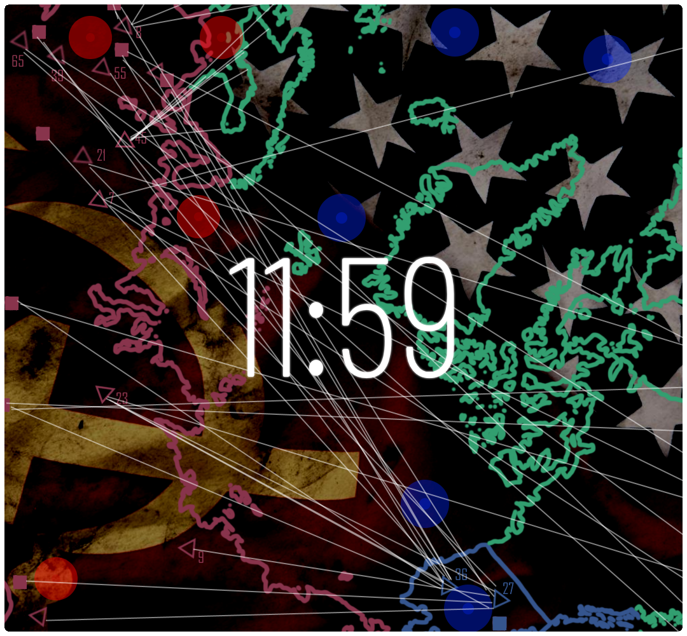

# 11:59 - A Cold War Mod
<p align="center">
    
<p align="center">
  
# How do I install this mod?
1. Extract the .zip that you have downloaded.
2. Copy your AoC2.exe from SteamApps/common/Age of Civilizations II into the "Age of Civilizations II" directory, within the extracted .zip folder.
3. Launch the game and play! Have fun!

# Credits 

```
Main Developer: Vis; aka IncogniStructura
Developers: Chexier
Age of Civilizations II: Łukasz Jakowski
Music: Paradox Interactive (East vs West OST), Introversion Software (DEFCON OST)
```
# License

```
MIT License
